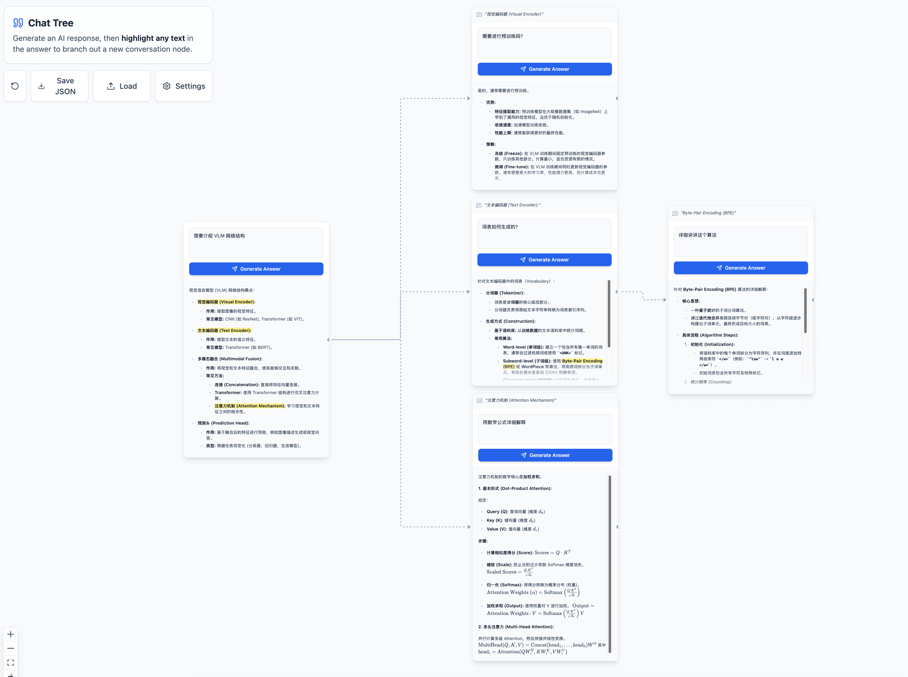

# Chat Tree

> **An infinite canvas chat interface for deep research**

<div align="center">
  
</div>

## ✨ Features

### 🌳 Multiple Node Types

- **Chat Nodes**: Traditional conversational AI nodes with streaming responses and full conversation history
- **Research Nodes**: AI-powered deep research with multi-step process:
  - Automatic query expansion into multiple search angles
  - Parallel web searching via Tavily API
  - Source aggregation with citations
  - Synthesized answers with proper references
- **Note Nodes**: Markdown-based note-taking with live preview for organizing your thoughts

### 🧠 Advanced AI Capabilities

- **Reasoning Modes**: Choose from multiple thinking modes (Off, Auto, Light, Medium, Heavy) for different complexity levels
- **Internet Search**: Enable real-time Google Search via Serper API for up-to-date information
- **Deep Research**: Multi-step research workflow that automatically discovers, reads, and synthesizes information from multiple sources
- **Streaming Responses**: Real-time AI output with progressive rendering

### 🎨 Interactive Features

- **Infinite Canvas**: Break free from linear chat interfaces with a zoomable, pannable workspace powered by React Flow
- **Smart Branching**: Select any text in AI responses or notes to create a new branch question
- **Context Inheritance**: Child nodes automatically inherit parent settings (reasoning mode, search toggles) and conversation history
- **Node Collapsing**: Collapse entire subtrees to keep your workspace organized
- **Flexible Resizing**: Resize nodes horizontally to fit your content
- **Visual Organization**: Drag and arrange nodes to build a knowledge tree that makes sense to you

### 📝 Rich Content Support

- **Markdown Rendering**: Full support for GitHub Flavored Markdown
- **Code Highlighting**: Syntax highlighting for code blocks
- **Mathematical Formulas**: LaTeX equation rendering with KaTeX
- **Tables**: Properly formatted markdown tables
- **Citations**: Automatic source citation and reference linking in research nodes

### 💾 Persistence & Configuration

- **Auto-Save**: Your entire workspace is automatically saved to browser's local storage
- **Import/Export**: Save and load your research trees as JSON files
- **Flexible API Support**: Compatible with any OpenAI-compatible API:
  - Google Gemini
  - OpenRouter
  - DeepSeek
  - Anthropic Claude (via OpenRouter)
  - And more...
- **Custom Configuration**: Configure API keys, base URLs, and model names through an intuitive settings interface

## 🚀 Getting Started

### Prerequisites

- Node.js installed on your machine.
- An API Key (OpenAI, Anthropic, Gemini, or OpenRouter).

### Installation

1. Clone the repository:
   ```bash
   git clone https://github.com/yourusername/chat-tree.git
   cd chat-tree
   ```

2. Install dependencies:
   ```bash
   npm install
   ```

3. Run the development server:
   ```bash
   npm run dev
   ```

4. Open [http://localhost:5173](http://localhost:5173) in your browser.

5. Click **Settings** in the UI to configure your API Key and Model.

## 🛠️ Tech Stack

- **Framework**: React + Vite
- **Canvas Engine**: React Flow
- **Styling**: Tailwind CSS
- **AI Integration**: OpenAI SDK

## 📄 License

AGPL-3.0
